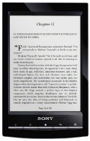

# Sony PRS-T1
All firmwares and files for Sony reader

Была у меня с 2011 года книжка Barnes & Noble Nook Tablet. Удобная. Весит, как энциклопедия, и в оригинальной кожаной обложке толщиной пол-сантиметра, как книга заклинаний. При покупке прошил сразу, чтобы все книги поддерживались.

В 2020-м полез на 4pda прошить снова - и не нашел ни одной живой ссылки. А сама команда CianogenMod давно распалась и их сайт с прошивками уже не существовал. За пару дней поисков нашел отдельные архивы, но не все. Но чтобы поставить Андроид 4.4.4 - хватило. Не хочу повторения такой судьбы для Sony PRS-T1, поэтому решил сделать зеркало.

Гитхаб позволяет редактировать и добавлять новые файлы через коммиты. Таким образом, получим долгоживущее хранилище.

## Как добавить новые файлы и инструкции
Обновления и добавления приветствуются, отправляйте коммиты.

## Что тут есть:
- **additional-apk** - Пакет самостоятельной установки приложений PRS-T1_Flasher_APP
- **fix_shutdown_bug** - Пакет PRS-T1_FIX_SHUTDOWN. Позволяет самостоятельно попытаться пофиксить ошибку, когда ридер не может нормально завершить работу при его выключении. Работает на любой версии ПО ридера и любой версии прошивки.
- **official-firmwares** - Официальные прошивки Sony с форума 4pda для RU- и US- устройств.
- **official-soft** - Программы с сайта-производителя для читалки. Они их тоже убирают ((
- **reanimation** - ИНСТРУКЦИЯ по восстановлению Т1, в том числе "железный способ"
- **restore-by-microsd** - Пакет для восстановления ридера в исходное состояние через карту microsd
- **restore-by-pc** - Пакет для восстановления ридера в исходное состояние через компьютер
- **unofficial-firmwares** - Неофициальные прошивки, включая пакеты CoolReader, Orion Viewer и сборника apk

## Источник: 4pda
ссылка: https://4pda.to/forum/index.php?showtopic=301887

## Где файлы?
В связи с жадностью Гитхаба файлы пришлось переместить сюда: https://cloud.mail.ru/public/1Ge2/2swoWuUTw
